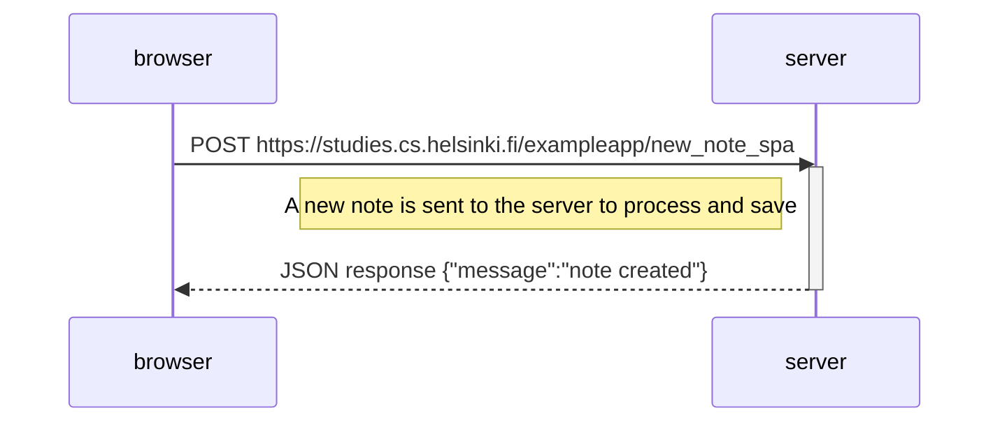

# New Note in Single page app Diagram

```mermaid
sequenceDiagram
    participant browser
    participant server

    browser->>server: POST https://studies.cs.helsinki.fi/exampleapp/new_note_spa

    activate server

    Note left of server: A new note is sent to the server to process and save

    server-->>browser: JSON response {"message":"note created"}
    deactivate server
```
